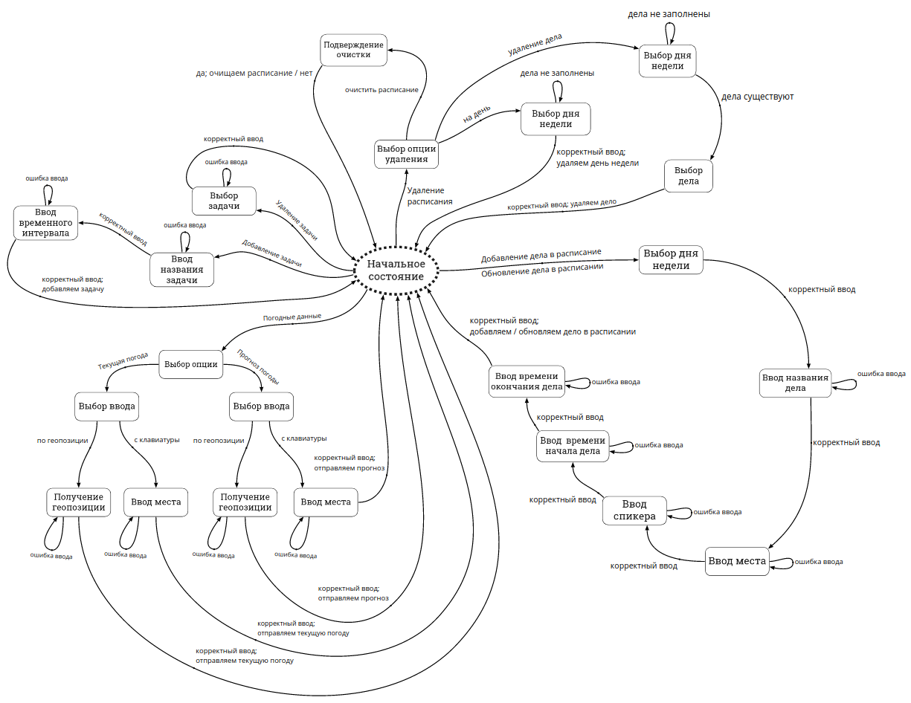
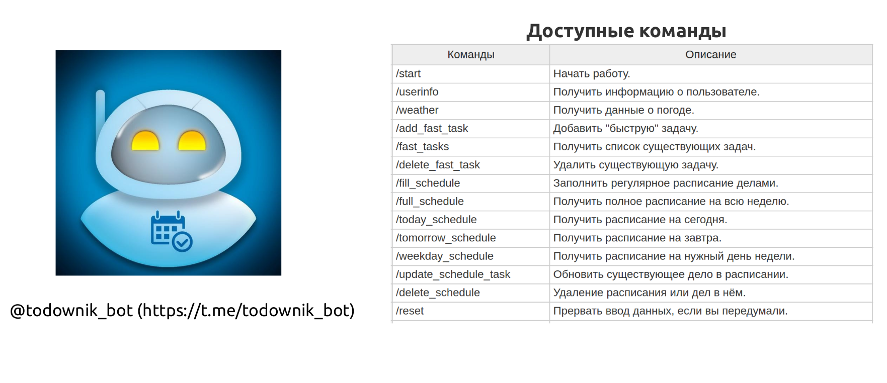

# Разработка веб-сервиса по планировке пользовательских задач


[](https://travis-ci.com/bmstu-iu8-g4-2020-project/todo_web_service)
[](https://goreportcard.com/report/github.com/bmstu-iu8-g4-2020-project/todo_web_service)


### Задание:

***

#### Разработать сервис, реализующий создание пользовательских задач и списков дел. Создать подпрограмму для мессенджера Telegram, которая посредством HTTP запросов будет взаимодействовать с сервисом. С помощью этой подпрограммы, пользователь должен иметь возможность составлять регулярное расписание, создавать/редактировать списки текущих дел, получать необходимые напоминания об установленных планах и задачах, получать полезную информацию от сторонних сервисов для правильного планирования распорядка дня.

***

## Архитектура проекта


## Конечный автомат для состояний пользователей

Пакет [__telegram-bot-api__](https://github.com/go-telegram-bot-api/telegram-bot-api) для работы с ботом «из коробки» не предоставлял
возможность выстраивать цепочки сообщений с пользователями, из-за чего
пришлось хранить состояния пользователей в виде уникальных кодов на
каждое состояние, а переходы между ними осуществлять в виде абстрактной
модели [конечного автомата](https://ru.wikipedia.org/wiki/%D0%9A%D0%BE%D0%BD%D0%B5%D1%87%D0%BD%D1%8B%D0%B9_%D0%B0%D0%B2%D1%82%D0%BE%D0%BC%D0%B0%D1%82). Все состояния сохраняются в базе
данных для каждого пользователя, таким образом падение сервера или
перезапуск бота не приводит к потере состояния для пользователя.



## Основные команды

[](https://t.me/todownik_bot "t.me/todownik_bot")

```
Copyright 2020 aaaaaaaalesha 
```
